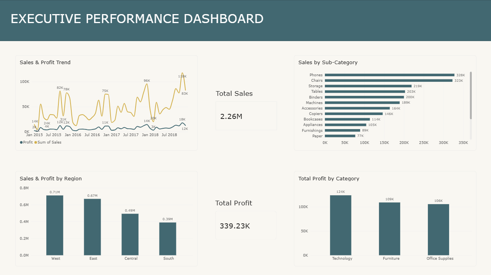

# Superstore Sales Dashboard


Power BI dashboard analyzing retail sales performance - trends, top sub-categories, regional split, and category profitability - built for executive-level reporting.

  
## Key Findings


- **Overall performance** →  `$2.26M` total sales generated `$339.23K` total profit across the dataset's full time range (2015-2018)

- **Top sub-categories by sales** →  Phones `($328K)` and Chairs `($323K)` lead, followed by Storage `($219K)` Tables `($203K)` and Binders `($200K)` - technology and furniture items dominate the top 5

- **Regional performance** →  West leads with `$0.71M` in sales, followed by East `($0.67M)` Central `($0.49M)` and South `($0.39M)` - nearly a 2x gap between the strongest and weakest region

- **Profit by category** → Technology is the most profitable category `($124K)` narrowly ahead of Furniture `($109K)` and Office Supplies `($106K)` - despite Chairs (Furniture) ranking #2 in sales, Furniture's profit contribution trails Technology, suggesting thinner margins on furniture items

- **Sales & profit trend** → Revenue shows strong seasonal spikes (notably late 2018, peaking near $118K in a single period) with profit tracking well below sales throughout - margin compression is visible even during high-sales periods
  

## Note on Methodology
- Profit margin (%) per category was not available/calculable from the fields in this dataset version - profit (absolute $) was used instead for the category comparison.


## Dashboard Preview




## Dashboard Features

- 4 interactive visuals: Sales & Profit trend (line), Sales by Sub-Category (bar), Sales & Profit by Region (bar), Total Profit by Category (bar)
- KPI cards for Total Sales and Total Profit
- Built in Power BI Desktop


## Tech Stack

- Power BI 
- DAX 


## Project Structure

```bash
├── data/           → Superstore CSV  
├── dashboard/      → Power BI file (.pbix) + dashboard screenshot
├── LICENSE         → MIT license  
└── README.md       → Project documentation 
```
